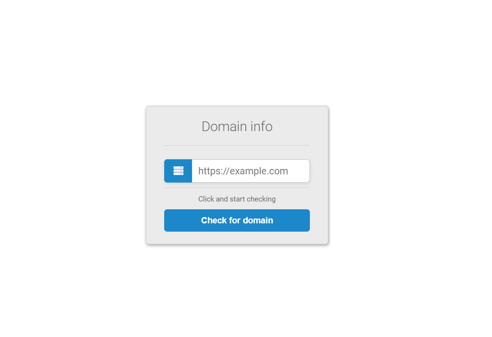

# Domain informer viewer for laravel package

- Exists controller, view, routes

> For installation 

**composer require rzakhanov/domain-informer**

> Route for  package look in site
**{host}/info**

**Preview**

